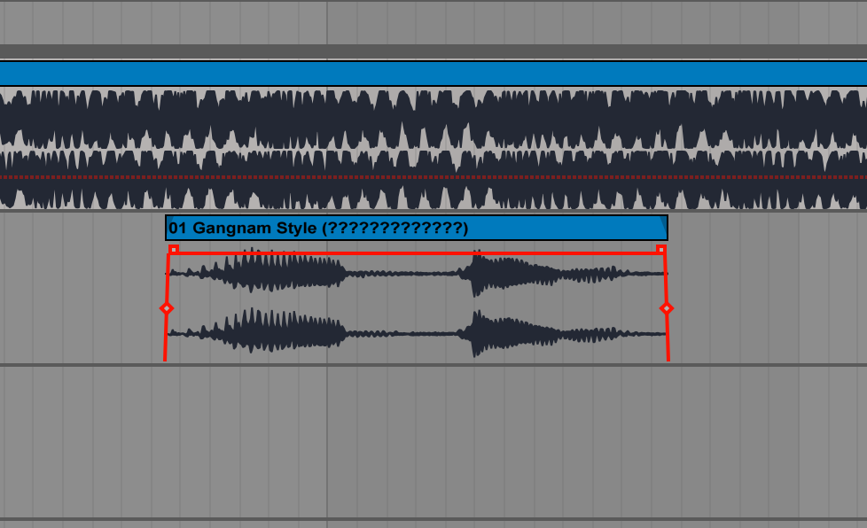

# WDI-PROJECT-1
This is my first project for the Web Development Immersive course at General Assembly. 

I wanted to create a memory game with sounds. There are 10 sounds and 20 boxes where the user can click and match the sounds. When two sounds are matched, the squares light up to signal that a match has been found.

In this project I used HTML to create content, CSS to style  and JavaScript to manipulate the DOM. I used the theme of Psy's Gangnam style for the styling and sounds.

When the user maches two sounds together, the relevant squares light up: 

For the sounds I edited the track from Psy's Gangnam style to find interesting breaks.

Editing sounds in Live: 

Improvements for later versions:  
Styling: making white square linings. Also, when the user finds a match, making the squares flash. 

Wins and challenges: 

Challenges : JavaScript Logic.  

Wins: idea conception, finding sounds.

Tech used: HTML5 audio, CSS, JavaScript. 

