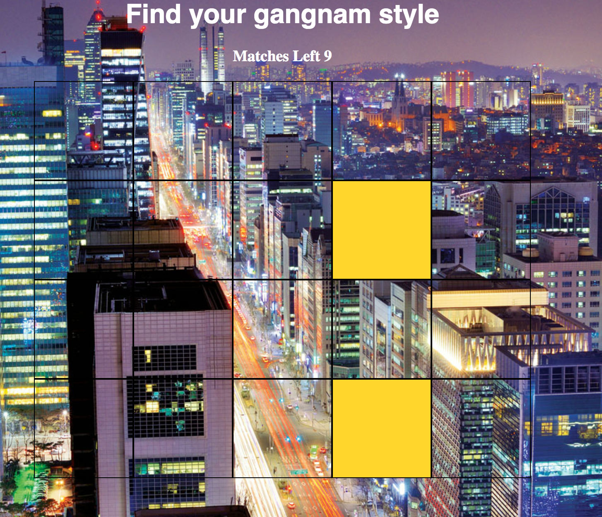

# WDI-PROJECT-1
This is my first project for the Web Development Immersive course at General Assembly.

This is a memory game where the user matches sounds. There are 10 sounds for the users to match. When two sounds are matched, the squares light up to signal that a match has been found.

I used HTML to create content, CSS to style  and JavaScript to manipulate the DOM. I used the theme of Psy's Gangnam style for the styling and sounds.

When the user maches two sounds together, the relevant squares light up:

I edited the track from Psy's Gangnam style to find interesting breaks.

###Improvements:  
Styling: making white square linings. Also, when the user finds a match, making the squares flash.

On/off function for background music.

###Wins and challenges:

####Challenges :
applying JavaScript Logic.  

####Wins:
idea conception, sound-editing.

Tech used: HTML5 audio, CSS, JavaScript.
